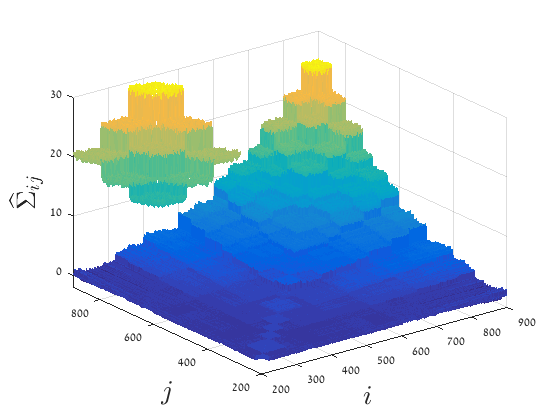

# informedMetricCode
Repository for the paper "Mahalanonbis Distance Informed by Clustering" by Almog Lahav, Ronen Talmon and Yuval Kluger. 

## Example 1 (Section 5 in the paper)

Run the sctript "globalMahalClust.m".

## Example 2 (Section 6 in the paper)

Run the script "syntheticToyProblem.m".

 

## Example 3 (Section 7 in the paper)
Gene expression data was taken from:
Director's Challenge Consortium for the Molecular Classification of Lung Adenocarcinoma., Shedden K, Taylor JM, Enkemann SA et al. Gene expression-based survival prediction in lung adenocarcinoma: a multi-site, blinded validation study. Nat Med 2008 Aug;14(8):822-7. PMID: 18641660.

### Dependencies:

1. Gene expression data:

	a. Download the file "GSE68465_caArray_jacob-00182.tar.gz" from: https://www.ncbi.nlm.nih.gov/geo/query/acc.cgi?acc=GSE68465. Extract the file to myDataPath.
	
	b. In the script "xls2mat_MSK.m" update the data path: dataFolderPathLoad = myDataPath;
	
	c. Run the script "xls2mat_MSK.m".
	
	d. In the script "xls2mat_CANDF.m" update the data path: dataFolderPathLoad = myDataPath;
	
	e. Run the script "xls2mat_CANDF.m".
	

2. kmplot.m - a Matlab function that calculates Kaplan-Meier survival plot. Download: http://www.mathworks.com/matlabcentral/fileexchange/22293 (update 20 Apr 2018), and save it at the folder "GenesExpression".

3. logrank.m - a Matlab function that calculates P-value. Download: http://www.mathworks.com/matlabcentral/fileexchange/22317 (update 26 Jun 2018), and save it at the folder "GenesExpression".

### MSK data set (Section 7.1 in the paper)

Run the script "mainGlobalMah.m".

To obtain Fig. 13 in the paper, change the following variable:

kClusters = 10 : 30;

### CANDF data set (Section 7.2 in the paper)

Run the script "mainLocalMah.m".

To obtain Fig. 16 and Fig. 17 in the paper, change the following variables:

knn 	= 10 : 5 :60; 

pIter 	= 20;

Note that runing with this setting will take a long time.  
